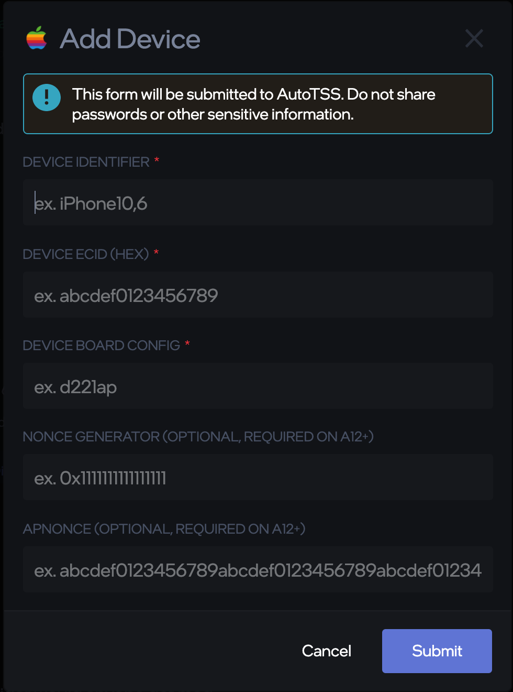
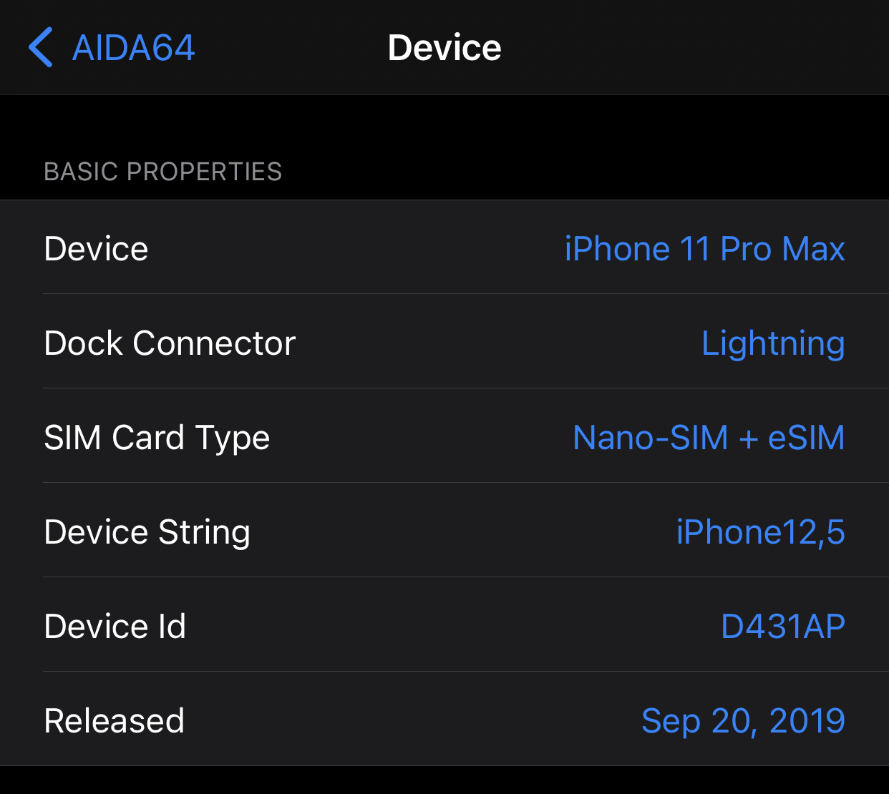
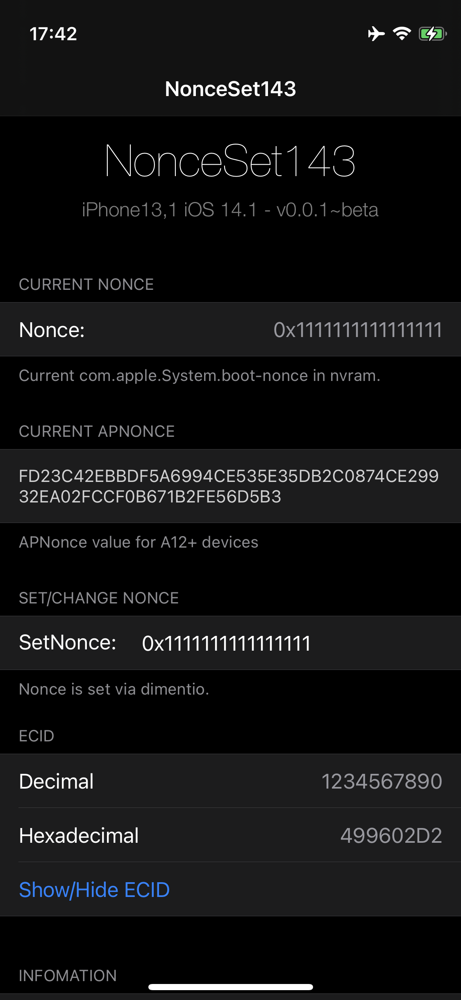

# How to use AutoTSS

[AutoTSS](https://github.com/m1stadev/AutoTSS) is a Discord bot by m1stadev that can automatically save SHSH blobs for your devices. 

> This bot is available in the r/Jailbreak Discord as `AutoTSS#9216`

## Adding a Device

`/devices add [name]`

> Add a device with the specified name.

When the command is entered, you will recieve this modal dialog: 

### Filling out the Fields
---
#### Unjailbroken Devices

1. Install [AIDA64](https://apps.apple.com/us/app/aida64/id979579523) on your device.
2. Visit the `Device` Section 
3. `Device String` is your Device Identifier.
4. `Device Id` will be your device's board config.

Download and install blobsaver from [here.](https://github.com/airsquared/blobsaver/releases)

> Using this program, you can also save blobs to your own computer and TSS Saver as an alternative to AutoTSS.

1. Plug your device into your computer.
2. Click "Read From Device" to retrieve your ECID
3. If your device is A12+, click the second "Read From Device" button to get your APNonce + generator pair. This will temporarily send your device to recovery mode.

#### Jailbroken Devices

install NonceSet143 from [ichitaso's repo](https://cydia.ichitaso.com)

**If you are on a non-checkra1n jailbreak on iOS 14, You will need to install `libkrw` (unc0ver) or `libkernrw0` (Taurine).**

After installing, you should have a new app on your home screen. Launching it should display something similar to this:  

This application has all the info required for AutoTSS.
1. Your Device Identifier is the text to the left of your iOS Version
2. Use the Hexidecimal ECID value
3. Scrolling down a bit further will show your "Device Model". This is your board config.
4. If your device is A12+, Specify The current generator and APNonce.

## Listing Saved Blobs

`/tss list`

A embed will appear with your devices and versions saved.

## Downloading Saved Blobs

`/tss download`

Within a few seconds, you will be given a link to download all your blobs.