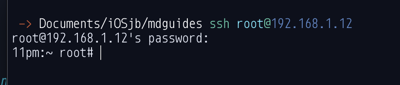

# How to SSH/SFTP into iOS Devices

| Table of Contents               |
| ------------------------------- |
| [Prerequisites](#prerequisites) |
| [How to SSH](#how-to-ssh) ([Windows](#windows) \| [macOS](#macos) \| [Linux](#linux)\) |
| [How to SFTP](#how-to-sftp)              |

## Prerequisites

- A jailbroken iOS Device
- A functional PC that's connected to the same WiFi network as your device.
  - This does not apply if you're connecting over USB.
- **OpenSSH (package) installed on your device.** 

## How to SSH

## Windows

### Using cmd (Command Prompt)

> Note: This section only applies if you're using the Windows 10 Spring update or newer.

#### Over Wi-Fi

> Locate your devices' (local) IP address in settings by tapping the "i" icon beside the connected network.

1. Launch Command Prompt (cmd)
2. Type in `ssh root@your.ip.here` and press enter.
3. You will be asked for a password. The password will be invisible when entered. Type `alpine` and press enter.

The output should look similar to this:

#### USB

> *Before continuing, you must install iTunes from Apple's website. (not the microsoft store) or else you will run into errors.*

1. Download the latest Windows release of libimobiledevice from [here.](https://github.com/libimobiledevice-win32/imobiledevice-net/releases/)
2. Extract the zip
3. Launch Command Prompt (cmd)
4. Drag usbmuxd.exe to it. Press return.
5. Open a second command prompt window and drag Drag iproxy.exe to it. Type `2222 22` after it.`iproxy.exe 2222 22`
    - If you are using checkra1n, use 44 instead of 22.
6. The output will should like this: 
7. Open a third command prompt window and type `ssh root@localhost -p 2222`
8. You will be asked for a password. The password will be invisible when entered. Type `alpine` and press enter.

## macOS

#### Wi-Fi

> Instructions are the same as recent Windows versions. Launch the Terminal app and continue from step 2.

#### USB (iproxy)

1. Launch the Terminal app.
2. Install Homebrew using this command: `/bin/bash -c "$(curl -fsSL https://raw.githubusercontent.com/Homebrew/install/HEAD/install.sh)"`. Press return after pasting it.
3. Be patient as Homebrew installs. You may be asked for your password during the process.
4. Once it's finished, you will be dropped back to a prompt with your username.
5. run `brew install libimobiledevice`
6. Connect your iOS device using a cable.
7. Open a new terminal window using Command+N
8. In the new window, type: `iproxy 2222 22` and press return. The output should look like this: 
   - If you are using checkra1n, use port 44 instead of 22.  
9. Go back to the old terminal window and type `ssh root@localhost -p 2222`
10. You will be asked for a password. The password will be invisible when entered. Type `alpine` and press enter.

## Linux

#### Wi-Fi (LAN)

> Instructions are the same as macOS/recent Windows. Launch a terminal emulator and continue from step 2.

#### USB (usbmuxd+iproxy)

 > Instructions are similar for both wifi and usb compared to macOS. Except that you should install libimobiledevice and usbmuxd with your existing package manager.

   Run `usbmuxd` in a terminal before trying to run `iproxy`.

## How to SFTP

SFTP allows you to access files on your devices. More powerful than iTunes and better for bulk file transfers.

### CLI (command line)

> Command line SFTP is for advanced users only. Follow the same instructions as SSH but replace `ssh` with `sftp`.

### Cross-Platform (GUI)

#### FileZilla

1. Get the latest release of FileZilla from the [website](https://filezilla-project.org/).
2. Launch the application.
3. If you're using Wi-Fi (LAN), enter your device's ip as the host, `root` as the username, and `alpine` as the password before clicking quickconnect.

If not, follow USB instructions for ssh above, but don't ssh into your device. Enter 2222 as the port and localhost as the host before clicking quickconnect.

If done properly, the files should be listed on the right side of Filezilla's window.

### macOS/Windows (GUI)

#### Cyberduck

1. Get Cyberduck from their [website](https://cyberduck.io/download/).
2. After installation, run it and Click "New Connection"
3. For WiFi connections: server is your device's ip address. Username is `root`. Default password is `alpine`
   USB connections should have the port set to what was used in the iproxy commands above (2222). Server should be localhost.

### Windows Only (GUI)

#### SSHFS-Win (Recommended)

> These instructions may seem complex at first, but the end result is having your device appear in File Explorer.

1. Install the latest (stable) release of [WinFSP](https://github.com/billziss-gh/winfsp).
2. Install [SSHFS-Win](https://github.com/billziss-gh/sshfs-win/releases). Choose the x64 or x86 installer according to your computer's architecture.
3. Install [SSFS-Win Manger](https://github.com/evsar3/sshfs-win-manager/releases/latest)
4. Setup your connections in SSHFS-Win Manager with the same data as SSH-ing would use.

#### WinSCP

1. Get the latest WinSCP release from [here](https://winscp.net/eng/download.php).
2. Launch it and enter your login details, following the same format as SSH-ing above. Then click Login.
3. If done correctly, you should see your files appear in a new window.
